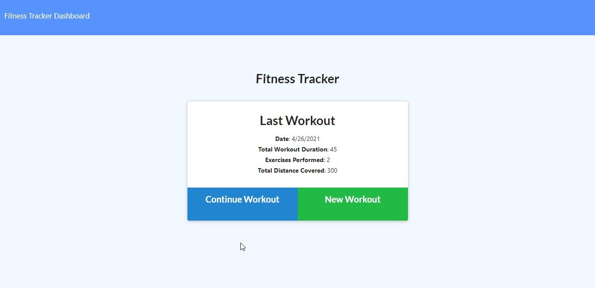
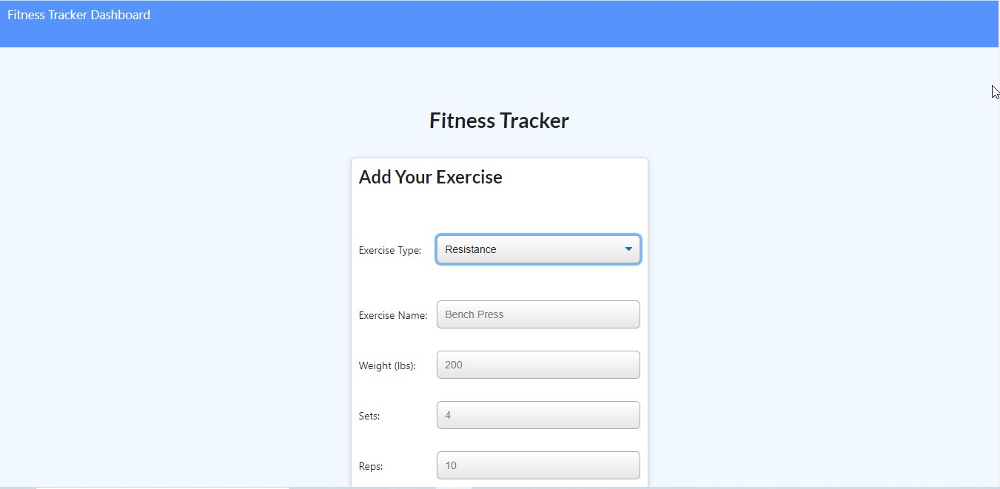
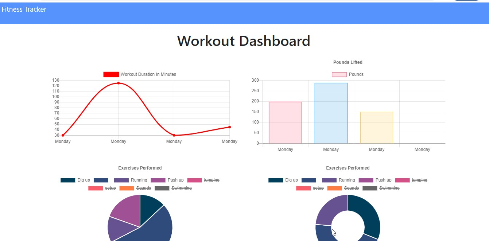

## License badge: ](https://opensource.org/licenses/ISC)

# Workout-Tracker

## Table of Content
- [Description](#description)
- [Motivation](#motivation)
- [Instructions](#instructions)
- [Usage](#usage)
- [Guidelines](#guidelines)
- [Test instruction](#test-instruction)
- [Lesson learned](#lesson)
- [Acknowledgement](#acknowledgement)
- [Question](#question)

## Description 

I developed a back end code for the workout tracker app. By using this app it is possible to track the name, type, weight, sets, repetetions,
 and duration of the exercise. In addition to that the user can add exercise to the most recent or to a new plan. Moreover,
 it is possible to view the combined weight of multiple exercises and total durations fo each workout. 
 The application designed for any one who want to use it. To develop this application, 
I used HTML, CSS, Javascript, a software registry and software package manager and installer called 
Node Package Manager (npm), express, Mongo data base, Mogoose  schema, node.js and other relevant node.js framworks. 

## Instructions

You do not have a limitation to use this application. As you see the license section at the top of this file it is open source to use, copy, modify, and/or distribute this app for any purpose. If you interested you can use and start developing your notes and daily rutines. If you want to test the app first right click on the server.js file and click on ‘open on integrated terminal’ or you can use a terminal and drag or write the file inside opened terminal. If it is going well as attached in the screenshot foldor install the npm in the terminal. When the installation is completed type node server.js and hit the enter button. Following that the server start to listen on port. Now you can open a google chrome and run a http://localhost:4040. Here you will get a note taking appliction and you can write, save, edit, delete and update your notes. If you face any problem or would like to reach me, you can find my contact in the question section.

## Usage 

This application is working properly. You can see a deployed live URL and a few screen shots for demonstration under test instruction section.

## Guidelines: 

Try to read and watch relevant materials, tutorials and practice, practice, ....!

## Test instruction 

I checked the application for many times, and it works well. If you want you can click on the link below. 

You can click on the following live URL:https://vast-falls-81756.herokuapp.com/

## Lesson-learned

I got some take away like how and when to use Mongo database, and additional mongodb syntaces like aggregate and sum.

## Acknowledgement

Mnstructor, my tutor, online information providers like google, you tube and others.

## Question

If you have any questions you can reach me via E-mail: bayleyegn100@gmail.com
Here is a link to my Github profile: http://github.com/bayleyegn100

